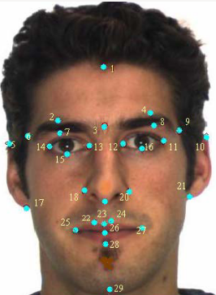

---
title:
- Automating Dating 
subtitle:
- with Web Drivers and Machine Learning
author:
- yohanderose.dev/blog-slug
date:
- https://github.com/yohanderose/Dat3Bot
theme:
- Warsaw
colortheme:
- dolphin
fontfamily:
- noto-sans
colorlinks: 
- true

---


# What is the aim?

- True love uwu.

- More realistically though -- some booty.

- Even more realistically, just optimising emotional investment.


You'll use selenium to interact with the tinder web app, and train a machine learning model on your attraction preferences to (hopefully accurately) decide on which way to swipe.

# Live Demo

Ooh, ambitious.


# Dependencies

General requirements

- Python >=3.6
- requests, pillow
- Selenium and chromedriver executable
- Scikit, numpy and pandas
- [deepface](https://github.com/serengil/deepface), [face-align](https://github.com/1adrianb/face-alignment), dlib and OpenCV

Personal stuff

- Add your login details to __credentials.py__ 
- Highly recommend you build your own dataset.
  I used a selection from [Liang et al.](https://arxiv.org/abs/1801.06345) and 
  [Kaggle](https://www.kaggle.com/datasets/gpiosenka/beauty-detection-data-set) to start, but bot will continue to scrape and add 
  to dataset. 

# Selenium

```python
# Clicks big blue button
webdriver.find_element_by_id('bigBlueButton').click()  

# Returns referential list of all buttons
all_buttons = webdriver.find_elements_by_tag('button')
```

# Selenium cont.

- Install the package, and put relevant [driver](https://chromedriver.chromium.org/downloads) into path

	https://chromedriver.chromium.org/downloads

- Make app modular or object oriented from the start

- Develop and debug with interactive flag

	```bash
	python3 -i main.py
	``` 
- Use the browser inspector to find web element info

# Making Models 

Jupyter Prototyping

- Creating a sensible numeric representation
  of a face (feature vector)

- build_dataset.py

<!--  -->
{ height=150px align=right }

# Making Models cont.

Scikit
	
- Training and comparing a variety of models
  on a bunch of labelled feature vectors

- train_model.py train.log

- test_model.py


# Deploying
 
- Bot.run()

- Extensions: PCA, Deep Learning

- Considerations:
	- Bot detection countermeasures
	- Social stigma and ethics
	- Security

