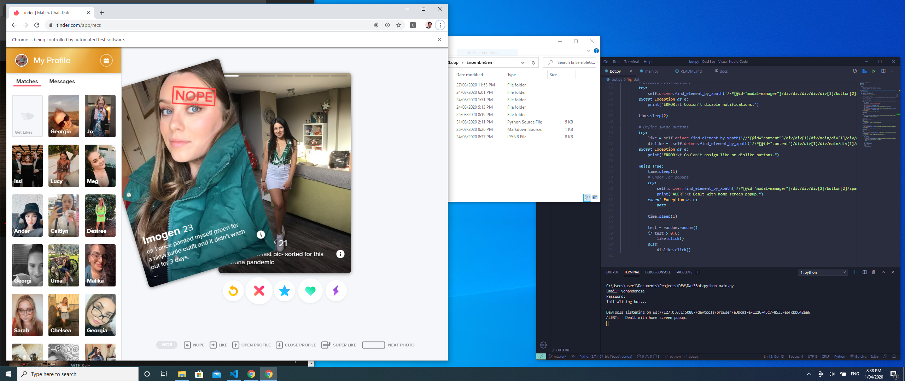

---
title:
- Automating Dating 
subtitle:
- with Web Drivers and Machine Learning
author:
- yohanderose.dev/blog-slug
theme:
- Copenhagen
date:
- https://github.com/yohanderose/Dat3Bot

---

# What is the aim?

- True love uwu.
- More realistically though, some booty.
- Even more realistically, just optimising emotional investment.

We'll use selenium to interact with the tinder web app, and then train a machine learning model on your attraction preferences to (hopefully accurately) decide on which way to swipe.

# Live Demo

Ooh, ambitious.

# Dependencies

General stuff

	- Python >=3.6
	- Selenium and chromedriver executable
	- Scikit, numpy and pandas

Personal stuff

	- Add your login details to __credentials.py__ 
	- Highly recommend you build your own dataset 

# The Swiping

# The Deciding

Jupyter Demo

	- Creating a sensible numeric representation
	  of a face (feature vector)

Scikit
	
	- Training and comparing a variety of models
	  on a bunch of labelled feature vectors

# Deploying

